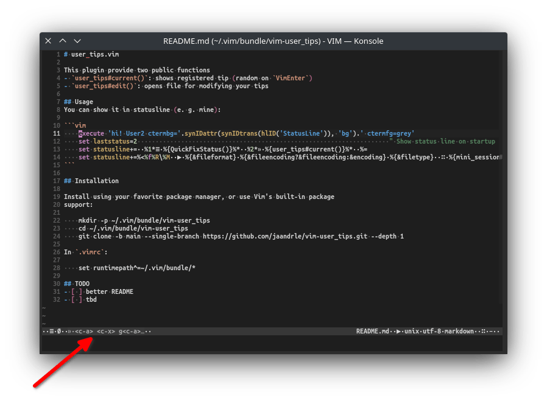

# user_tips.vim

This plugin provide two public functions
- `user_tips#current()`: shows registered tip (random on `VimEnter`)
- `user_tips#edit()`: opens file for modifying your tips

## Usage
    You can show it in statusline (e. g. mine, the relevant part is `%2*»·%{user_tips#current()}%*`):

```vim
    execute 'hi! User2 ctermbg='.synIDattr(synIDtrans(hlID('StatusLine')), 'bg').' ctermfg=grey'
    set laststatus=2                                                                     " Show status line on startup
    set statusline+=··%1*≡·%{QuickFixStatus()}%*··%2*»·%{user_tips#current()}%*··%=
    set statusline+=%<%f%R\%M··▶·%{&fileformat}·%{&fileencoding?&fileencoding:&encoding}·%{&filetype}··∷·%{mini_sessions#name('–')}·· 
```
… leads to:



… for editing use for example:

```vim
    nnoremap <f5> :call user_tips#edit()<cr>
```

## Installation

Install using your favorite package manager, or use Vim's built-in package
support:

    mkdir -p ~/.vim/bundle/vim-user_tips
    cd ~/.vim/bundle/vim-user_tips
    git clone -b main --single-branch https://github.com/jaandrle/vim-user_tips.git --depth 1

In `.vimrc`:

    set runtimepath^=~/.vim/bundle/*
